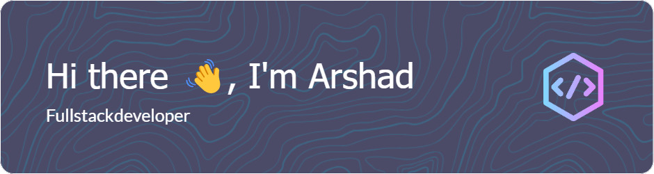

<!--

-->

# 💫 About Me:
🏥 Developing smart IoT solutions for healthcare 💼 Preparing for placements and enhancing my DSA skills

## 🌐 Socials:
 
-------------
* ✉️  You can contact me at [ak4566335@gmail.com](mailto:ak4566335@gmail.com)

# 💻 Tech Stack:
                      

## 🚀 Projects  

1. 💊 **Automated Medicine Dispenser Assistant (AMDA)**  
   An AI-powered dispenser with smart healthcare solutions aimed at improving medication adherence.  

2. 🍴 **EatEase**  
   A simple React-based frontend web app that mimics a food-ordering platform like Zomato. Built as a single-page application, it displays a list of restaurants and food items with a clean UI.  

3. 💸 **Expense Tracker App**  
   A React-based web app to track incomes and expenses, featuring **Google Sign-In** and **Firebase integration**.  
   Styled using **Tailwind CSS** and standard CSS, it enables users to manage finances with real-time updates.

# 📊 GitHub Stats:

<!--

-->

### 🔝 Top Contributed Repo

<!--
**Arshad-Khan-12/Arshad-Khan-12** is a ✨ _special_ ✨ repository because its `README.md` (this file) appears on your GitHub profile.

Here are some ideas to get you started:

- 🔭 I’m currently working on ...
- 🌱 I’m currently learning ...
- 👯 I’m looking to collaborate on ...
- 🤔 I’m looking for help with ...
- 💬 Ask me about ...
- 📫 How to reach me: ...
- 😄 Pronouns: ...
- ⚡ Fun fact: ...
-->

<!--
# 💫 About Me:
🏥 Developing smart IoT solutions for healthcare 💼 Preparing for placements and enhancing my DSA skills

## 🌐 Socials:
 

# 💻 Tech Stack:
                      
# 📊 GitHub Stats:
 
 

### 🔝 Top Contributed Repo

<!-- Proudly created with GPRM ( https://gprm.itsvg.in ) -->
<!--
-->
